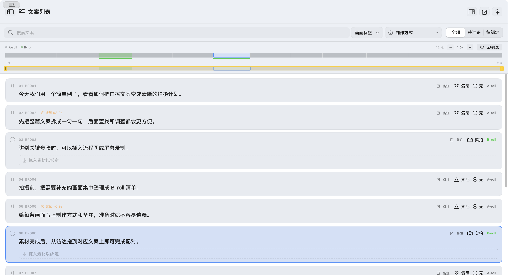

# B-roll配对台

做口播视频时，B-roll 往往带来两轮重复工作：剪到需要补画面的地方才去拍摄、导入素材；素材备齐后，又要逐条找到对应台词，把画面放到时间线上。

B-roll配对台是一款免费、以 GPLv3 开源的原生 macOS 辅助工具。它让你先从文案列出 B-roll 任务，集中拍摄或制作；再用拖拽把素材绑定到对应台词。App 会整理好剪辑项目文件夹和文案与素材的对照表。把这个文件夹连同 App 提供的提示词交给具备 ChatCut 剪辑能力的 AI，即可让 AI 执行口播与 B-roll 的时间线粗剪。

> **A-roll** 是对着镜头讲述的主画面。**B-roll** 是穿插在口播中、用于补充说明的画面，可以是实拍、动画、AI 生成视频、图片加动效、现成素材或录屏。

## 功能亮点

- **把文案变成拍摄计划**：导入或粘贴文案，按句整理；逐条标记 A-roll / B-roll，选择制作方式、拍摄设备并添加备注，也可拆分和合并条目。
- **交互式全文时间线**：按文案长度排列片段，用颜色查看 A-roll / B-roll 分布和 B-roll 制作方式。时间线可跟随文案列表或切到全文总览，支持缩放、平移；点击片段会定位文案，选中状态双向联动。
- **跟踪准备进度与口播节奏**：用统一筛选器按 A-roll 拍摄设备、制作方式，以及 B-roll 制作方式、准备状态只看或排除条目，完成后标为“素材就绪”。可配置 A-roll 连续时长提醒和估算语速，帮助发现长段连续口播。
- **拖拽配对并整理素材**：从访达或素材来源目录拖入图片、视频；一条文案可绑定多个素材。App 将副本归档到项目中，生成文案与文件名对照表，来源原件保持不动。
- **AI 动画助手**：用 DeepSeek 分析全文并推荐适合动画呈现的段落；确认后再应用，可撤销。统一管理风格、角色参考图和可复用提示词模板，并复制单条或整批制作提示词。
- **交给 ChatCut AI 做粗剪**：导出正确文案、B-roll 素材映射和剪辑提示词，交给具备 ChatCut 剪辑能力的 AI 生成可继续编辑的时间线。B-roll 配对台负责整理项目资料，实际剪辑由 ChatCut 完成。
- **项目可持续接着做**：项目分类、制作方式、准备状态、拍摄设备、命名前缀和素材绑定关系会保存，之后可重新打开项目继续整理。

## 下载

适用于 macOS 14 或更新版本。Apple Silicon 用户可下载 [B-roll 配对台 1.0.7（arm64 DMG）](https://github.com/knockkeykey/B-roll-Desk/releases/latest/download/B-roll-Desk-1.0.7-arm64.dmg)，打开后将 App 拖入“Applications”。



*示例项目展示全文分布、A-roll / B-roll 标记和时间线与文案的选中联动。*

## 从文案到粗剪

### 1. 建立项目并导入文案

选择一个空的“剪辑项目文件夹”，App 会在其中创建 `A-roll/` 和 `B-roll/`。将录好的口播视频拖到“上传 A-roll”区域，或点击按钮选择视频；App 会复制一份到 `A-roll/`，原文件保留。

导入已写好的文案，可以粘贴内容，也可以选择 `.txt` 或 `.md` 文件。按换行或句号拆分后，App 会生成文案列表，并把内容保存到 `A-roll/正确文案.txt`。之后在 App 中修改文案，这份文件也会同步更新。

### 2. 列出要做的 B-roll

逐条判断画面类型：保持 **A-roll**，或切换成 **B-roll**。A-roll 条目制作方式默认是「无」，可以选择「文字」或「搜索素材」，也可以改回「无」；B-roll 条目可以选择实拍、动画、AI 生成视频等制作方式，并写下备注。制作方式随项目保存，切换 A-roll / B-roll 后再切回来会保留各自的选择。双击条目可改文案；在句末按回车可拆分条目，在条目开头按 Backspace 可与上一条合并。

A-roll 条目还可以选择拍摄设备，默认是「索尼」，初始选项为「索尼」「大疆」，也可以手动选择「无」。左下角设置中的「拍摄设备」可新增、改名、删除选项，点击「保存设备选项」后保存在本机，供所有项目使用。每条文案的设备选择随项目保存，重启或重新打开项目后恢复；设备选项改名会同步当前选择，删除选项会保留已有文案记录的设备名称。

点工具栏的“筛选”，在 B-roll 准备状态里点一下“待准备”（只看），就能集中查看需要拍摄或制作的 B-roll。每个选项点一下只看、再点一下不看、第三下取消；A-roll 和 B-roll 各自按自己的条件筛选后一起显示，也可以整栏关掉。生效的条件会显示在工具栏上，点 × 可单独移除。搜索收在工具栏右侧的放大镜里，按 ⌘F 打开。完成一项后，将状态改为“素材就绪”，再继续处理下一项。这样可以先把画面准备齐，再统一进入剪辑环节。

左下角设置可以启用或关闭 A-roll 节奏提醒，并自定义估算语速和连续口播时长阈值。默认按 350 字/分钟估算，连续 A-roll 超过 5 秒时提示；计算忽略标点和空白，B-roll 会中断连续时长。提醒仅供参考，实际节奏以口播为准。

文案列表上方的分布时间线默认使用“自适应”，随列表当前可见文案移动，保持你设置的缩放比例；点击模式按钮可切到“全局总览”，固定显示全文，切回自适应时恢复之前的比例。用 `−` / `+` 手动缩放，拖动黄色范围框平移，拖动两端调整范围。缩放比例会自动记住，重启 App 后也会恢复；滚动文案列表只改变时间线位置。点击文案条目或时间线片段，两边会同步以浅蓝底色和蓝色描边保持选中；点击时间线还会定位对应文案。片段宽度按口播字数分配，下方色条显示 B-roll 的制作方式。

### AI 分析动画文案

文案列表编辑按钮旁的“AI 动画助手”可以配置 DeepSeek API Key（保存在 macOS 钥匙串），默认使用 `deepseek-flash`。分析会把全文发送给 DeepSeek，按可编辑的判断规则筛选流程、结构、配对等适合示意动画的原文。所有有文字的条目都参与分析，不按 A-roll / B-roll 标签、制作方式、准备状态、已有绑定或动画任务过滤。结果通过原文校验后，先列出推荐段落供勾选；确认应用后才拆分文案并标记为 **B-roll / 动画**，新增任务设为待准备，保留已有素材绑定。表达重点会写入条目备注，保留已有手写内容；同一段再次分析时更新对应内容，保留任务 ID 和输出文件名。整次操作支持撤销。

在文案列表筛选“动画 + 待准备”，即可查看制作清单。条目上的“复制提示词”可复制单条，助手中始终保留“复制全部提示词”。备注可编辑，修改后复制的提示词会使用最新备注作为“表达重点”。共同的风格参考、角色参考图、音效和命名要求只写一次；每条动画只列“文案”和“表达重点”。模板可编辑，`{{text}}` 会替换成对应文案。统一制作要求规定视频文件名与文案一致，所有成品输出到同一个目录；同时确保制作 AI 能访问模板中引用的角色设定图。

### 3. 把素材配对到台词

可以直接从访达把图片或视频文件拖到对应文案条目上，无需先添加素材来源目录。也可以把完成的 B-roll 素材放进素材来源文件夹，并在右侧素材列表中打开该文件夹。可以先填写“B-roll 命名前缀”，例如期数或主题，方便以后查找。

在左侧找到对应的 B-roll 文案，把右侧素材拖到这条文案上即可绑定；一条文案可以绑定多个素材。App 会将已绑定素材**复制**到项目的 `B-roll/`，按规则命名，并生成文案与文件名的对照表。素材来源文件夹中的原件不会被移动或重命名。在筛选器里把“已绑定”设为不看，可检查还有哪些 B-roll 条目没有配对素材。

### 4. 交给 AI 完成粗剪

点击“复制提示词”，把提示词和**整个剪辑项目文件夹**一起提供给支持 ChatCut 剪辑插件的 AI。提示词要求 AI 参考 `A-roll/正确文案.txt` 剪辑实际口播，再按 `B-roll/broll-for-codex.json` 把指定素材放在对应台词的位置，并保存可继续编辑的 ChatCut 时间线。

配对台负责整理任务、素材和绑定关系；时间线剪辑由 AI 通过 ChatCut 执行。提示词要求 B-roll 视频静音并保留 A-roll 原声。完成后仍需在剪辑软件中检查口播、画面位置和节奏。

## 项目文件夹里有什么

```text
剪辑项目文件夹/
├── A-roll/
│   ├── A-roll.mov                 # 口播视频副本，扩展名随原文件
│   └── 正确文案.txt                # App 中确认和持续更新的文案
└── B-roll/
    ├── 第15期_BR001_文案短句.mp4   # 已绑定素材的副本
    ├── broll-for-codex.json        # 交给 AI 的文案与素材对照表
    ├── broll-manifest.json         # App 使用的完整绑定记录
    └── project-settings.json       # 文案分类、准备状态等项目设置
```

`broll-for-codex.json` 的主要内容是每段文案和它绑定的素材文件名：

```json
{
  "placements": [
    {
      "text": "这里是对应的完整文案",
      "files": ["第15期_BR001_文案短句.mp4"]
    }
  ]
}
```

这些编号用于整理素材，不代表剪辑时间码。交给 AI 时提供整个项目文件夹即可，不需要手动编辑对照表。

## 开发验证

运行 `Tests/run-animation-tests.sh` 可检查分段原文完整性、全文分析、已有设置条目推荐及重复任务更新、完整提示词导出、项目恢复及撤销。DeepSeek 请求测试使用离线模拟响应，不调用真实账户。

运行 `Tests/run-filter-tests.sh` 可检查文案筛选的只看 / 不看三态、A-roll 与 B-roll 分开筛选、未设置设备及空白条目的处理。

运行 `Tests/run-timeline-tests.sh` 可检查时间线缩放、平移、手柄边界、可见范围跟随、搜索结果及文案删除后的定位；列表滚动和鼠标拖拽还需在实际 App 窗口中验证。

## 安装与运行

- 需要 macOS 14 或更新版本。
- 从源码运行：用 Xcode 16.4 或更新版本打开 `B-roll Desk.xcodeproj`，选择 `B-roll Desk` scheme 并运行。
- App 通过 macOS 文件选择面板获取剪辑项目文件夹和素材来源目录的访问权限。重新打开项目时，会从项目设置恢复文案分类、制作方式、准备状态、命名前缀和绑定关系。

本仓库的 macOS App 源码位于 `BRollDeskApp/`。

## 许可证

除 `BRollDeskApp/Fonts/` 中的第三方字体及其许可文件外，本仓库的项目代码、文档和图标以 **GNU GPLv3（GPL-3.0-only）** 授权，完整条款见 [LICENSE](LICENSE)。分发基于本项目的修改版时，须遵守 GPLv3，并向接收者提供相应源码。仅供自己使用的修改无需公开；使用本 App 制作的视频和文案也不会因此自动受 GPLv3 约束。

内置的 `SmileySans-Oblique.ttf`（得意黑）由其权利人按 **SIL Open Font License 1.1** 单独授权，版权声明与条款见 [OFL.txt](BRollDeskApp/Fonts/OFL.txt)。项目的 GPLv3 许可不替代该字体许可。
