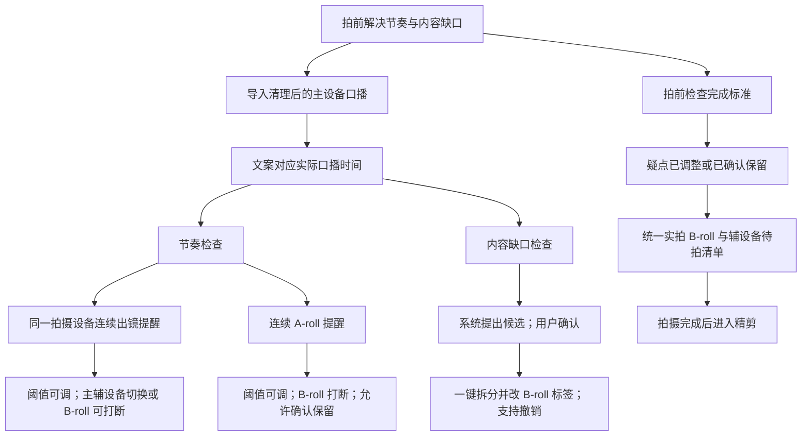

# 拍摄与剪辑分离：拍前检查功能规划

日期：2026-10-06  
状态：三个阶段的功能代码已实现，自动化测试与 Debug 构建通过，部分真实界面操作已验证；本机语音识别及在线 AI 的实际素材效果仍待验收。

## 目标与依据

把剪辑时才发现的画面问题提前到补充拍摄之前解决，让拍摄阶段执行已经确定的画面安排。

本次主要解决两类返工：

1. 剪辑时发现 A-roll 的主设备画面持续太久，需要实拍 B-roll 或辅设备拍摄的 A-roll。
2. 剪辑时发现某句话需要展示具体内容，拍前没有安排对应画面。

漏拍较少发生，统一拍摄清单作为辅助。用户没有因镜头质量或新增创意而补拍的常见问题，因此本期不增加逐条拍后质检、备用版本拍摄或强制拍摄描述。

## 已确认的工作方式

| 事项 | 访谈结论 |
| --- | --- |
| 口播基准 | 先用现有粗剪工具清理主设备 A-roll 的口误、重复和停顿，再把清理后的视频导入配对台。 |
| 画面变化 | 优先插入 B-roll。部分没有合适 B-roll 的段落，允许在主设备与辅设备拍摄的 A-roll 之间变化。 |
| 辅设备用途 | 本次用户用来表达自己的感受；或在缺少 B-roll 的段落替换主设备的一句。 |
| 辅设备声音 | 本次用户重说指定句子，同时替换主设备 A-roll 的画面和声音。 |
| 主/辅设备 | 角色属于拍摄设备：项目指定主设备与辅设备，两者不能是同一个设备。本次用户主设备为索尼、辅设备为大疆；其他用户可以选择自己的设备。 |
| A-roll 阈值 | 秒数可以调整，5 秒只是初始参考；两类提醒独立设置。 |
| B-roll 时长 | 通常约 2～4 秒，但不定死，不设置强制最短时长。 |
| 拍摄描述 | 用户不填写；系统可以提供简短候选画面，不要求补写。 |
| AI 内容检查 | 已接受 AI 文本分析：主动检查时提出内容缺口与候选画面，程序校验原文，用户确认后执行修改。 |
| 检查方式 | 疑点列表与局部口播播放为主，整体预演可作为后续可选能力。 |
| 修改标签 | 用户点击“安排 B-roll”后直接修改，不再要求手动重复操作。 |
| 制作方式 | 系统新安排的 B-roll 没有明确制作方式时显示“未确定”；可在检查卡片里选择方式并一起应用。已有明确选择保留。 |
| 拆分文案 | 确认 B-roll 时可以同时自动拆分文案行，只修改相应部分，保留原文字句。 |
| 检查完成 | 所有疑点均已调整或明确确认保留后，显示“检查完成”；始终允许拍摄。 |

## 决策树



## 功能一：实际口播时间对应

目的：让拍前判断依据清理后的真实口播，而非仅按文案字数与语速估算。

### 使用方式

- 导入清理后的主设备口播视频，系统建立文案与口播时间的对应关系。
- 文案行显示实际时长；点击可播放对应的口播片段。
- 时间线使用实际时长显示计划中的 A-roll/B-roll 分布。
- 未导入口播时，保留现有估算能力，并明确显示“估算”。
- 无法可靠对应的句子显示“需确认”，不能伪装成已获得准确时间。

### 内容规则

实际口播决定时间对应关系。转录与定位不能自动改写用户文案、补造台词或替换口播。自动拆分只改变行的边界，不改变原文字句。

拍前尚未录制的辅设备 A-roll，以主设备对应句子的实际时长作参考，并标明“辅设备口播时长待定”。本次用户的辅设备 A-roll 会同时替换声音，因此可能改变最终长度；如果之后导入实际辅设备口播，应重新计算受影响的结果。未获得新声音的实际时间前，不宣称已经验证最终时长。这个过程不增加逐条拍后回看的要求。

## 功能二：两类节奏提醒

目的：区分“同一拍摄设备的 A-roll 画面太久”和“连续口播缺少 B-roll”。

项目设置保存主设备、辅设备的选择，按设备 ID 关联到已有设备目录；每行继续保存实际拍摄设备，不额外设置独立的“主画面/辅画面”标签。两种设备角色不能指向同一个设备。设备名称可以新增或改名，名称变化不改变同一设备的身份。

| 提醒 | 累计方式 | 可以怎样处理 |
| --- | --- | --- |
| 同一设备连续出镜 | 连续由同一设备拍摄的 A-roll 累计；主设备切辅设备、辅设备切主设备或进入 B-roll 后中断。 | 安排 B-roll、切换拍摄设备，或确认保留。 |
| 连续 A-roll | 主设备与辅设备拍摄的片段都累计为 A-roll；进入 B-roll 后中断。 | 安排 B-roll，或确认保留。主/辅设备切换仍属于 A-roll。 |

### 设置

- 两项各自有开关与秒数设置。
- 沿用已有的连续 A-roll 设置；新增的同设备提醒可先以 5 秒为默认参考。
- 用户可以在设置中调整，无须证明某个秒数是最佳值。
- B-roll 的 2～4 秒可作为安排建议，不设强制下限或上限。

### 疑点显示

显示涉及的文案、实际连续时长、触发的规则，并支持播放对应片段。对同一个位置触发的两类提醒集中展示，避免重复处理。

系统提出调整方向，用户决定画面安排。没有合适 B-roll 的段落可以确认保留，以免为了清除提醒强行插入不相关画面。

## 功能三：内容缺口检查与一键修改

目的：找出时长没有超标、但内容本身可能需要画面的句子。

### 候选范围

优先检查操作步骤、产品或界面细节、结果、前后对比，以及“这里”“这样”“看这个”等依赖可见画面的表达。已经安排 B-roll 的内容应展示现有安排，避免重复建议。

纯观点和个人感受不因出现某个名词就必须变成 B-roll。个人感受可以保留主设备拍摄的 A-roll，也可以由用户指定辅设备拍摄。

### 候选画面的实现逻辑（已确认）

这是一项 AI 文本分析能力。内容缺口和一句简短画面建议由 AI 提出；时长计算、原文定位、拆分和保存由程序执行。

1. 用户点击“检查画面”后，程序准备当前文案快照、上下文以及每段已有的 A-roll/B-roll 标签和制作方式。实际口播时间由时间对应模块取得，不能让 AI 猜秒数。
2. 内容检查这一步向 AI 发送文本与安排信息，不需要发送整段视频。按语义完整的段落组织输入，并告知用户倾向于简单、实用的画面，不要求复杂拍摄描述。
3. AI 返回需要展示内容的原文引用、所在行、原因和一句候选画面。已经安排好的 B-roll 避免重复建议；普通观点、感受或单独出现的名词不自动视为缺口。
4. 程序验证输出：行引用有效、引用确实逐字存在于原文、位置唯一、候选之间不重叠。位置不明确或内容被 AI 改写时，不执行拆分。
5. 候选卡片展示原文、局部播放、原因、画面建议和制作方式选择。用户可以保留口播，或点击“安排 B-roll”。
6. 用户确认后，程序依据已经校验的原文范围定位和拆分，修改标签，并保存用户选择的制作方式。没有明确选择时写入“未确定”，不根据 AI 的画面建议自动当成实拍。
7. 文案快照改变后，过期候选不能继续应用。相同输入与已确认结果可复用，避免每次修改或滚动都发起新的 AI 请求。

候选画面只说明“展示什么”。例如原文“把视频拖入软件，就能自动生成字幕。”，建议可以是“展示拖入视频和字幕生成后的界面”。系统不能凭空添加文案没说的产品功能，也不会生成实拍素材。

一个输出示例：

```json
{
  "candidates": [
    {
      "source_row_ids": [12],
      "text": "把视频拖入软件，就能自动生成字幕。",
      "reason": "这句描述操作和结果，画面可以帮助理解。",
      "visual_hint": "展示拖入视频和字幕生成后的界面。"
    }
  ]
}
```

AI 返回原文引用，程序计算字符范围和对应时间，不依赖 AI 提供字符偏移或直接改写文案。

当前项目已有 AI 动画文案筛选与严格原文定位、拆分校验能力，可以复用连接配置和定位校验的数据流。内容缺口检查需要独立的任务、提示词及输出字段；现有动画筛选的规则保持原用途，不能直接拿它的结果当成拍摄描述。

AI 只能提出可能的内容缺口。该文本检查没有观看实际素材，不能判断现有视频是否满足建议，也不能保证发现所有创作需要；“检查完成”仍以用户确认各项安排为准。

### 一张检查卡片需要展示

- 对应的原文短句与口播片段。
- 为什么建议补充画面，例如“这句话描述操作结果，可以展示结果”。
- 一句可选的候选画面，不要求用户编辑或填写。
- 修改前后的范围预览。
- “安排 B-roll”与“保留口播”操作。

### 点击后的行为

“安排 B-roll”是一次明确的修改操作：需要时自动拆分原行，只把候选对应部分改为 B-roll，其余部分保留原安排。

一次确认产生一个完整撤销步骤，撤销时同时恢复拆分、标签与制作方式。未涉及的拆分部分继承原行的拍摄设备和相关设置，不能因成为新条目就丢失原安排。

### 自动安排后的制作方式（已确认）

当前应用中，首次把 A-roll 改为 B-roll 会显示“实拍”；此前明确选择过 B-roll 制作方式的条目，会恢复原选择。模型已经支持“未确定”。

针对系统自动安排采用以下规则，不改变现有人工操作的默认行为：

| 情况 | 修改后显示 |
| --- | --- |
| 首次由系统安排 B-roll，用户尚未选择制作方式 | 未确定。 |
| 用户在检查卡片中选了制作方式，再确认安排 | 所选方式，例如实拍、屏幕录制、搜索素材。 |
| 对应片段已有用户明确选择的制作方式 | 保留原选择，除非本次明确改选。 |

检查卡片提供现有制作方式选择，让一次确认同时写入拆分、B-roll 标签与制作方式。用户也可以先安排 B-roll、之后再选方式；这时显示“未确定”，进入制作方式待确认列表，不自动加入实拍任务。

“未确定”需要选择方式后才算该条准备安排明确；实体拍摄清单仅包含制作方式为“实拍”的 B-roll。这样不会把“需要 B-roll”直接等同于“需要拿设备拍摄”。

“保留口播”保存用户对本次疑点的结论，避免相同内容、相同安排下反复提醒。

系统未获得用户确认时，只提出候选；用户确认后直接执行，不增加第二次手动改标签的步骤。

## 功能四：拍前检查状态与统一拍摄清单

目的：给“安排检查完了”和“镜头拍完了”各自一个明确含义。

### 拍前检查状态

- **待检查**：还没有针对当前口播与画面安排运行完整检查。
- **有待确认项**：存在尚未调整、也未确认保留的节奏或内容疑点，以及需要确认的时间定位和制作方式未确定的 B-roll。
- **检查完成**：本次所有疑点均已有结论。

“检查完成”意味着疑点均已处理，不代表系统能够判断一切创作需求。内容检查给出候选，最终安排由用户确认。

任何状态都允许拍摄，不禁用现有操作。状态与未处理数量应清楚显示，让用户知道是否已经完成本次拍前检查。

### 安排变化后的处理

改变文案、标签、每行拍摄设备、项目主/辅设备设置、制作方式、阈值或口播源时，重新计算受影响部分；需要重新确认的项目恢复为待确认，不把旧结论直接套在新安排上。只改同一设备的显示名称不改变计时，但改为另一设备会影响连续出镜判断。

若已进入拍摄，安排变化应指出拍摄清单新增或减少了哪些任务。保持已有拍摄记录，不冻结文案或禁止调整。

### 统一拍摄清单

收集两类实体拍摄任务：

1. 制作方式为实拍的 B-roll。
2. 需要另拍、尚未完成的辅设备 A-roll；已经准备好的片段不产生补拍任务。

每项显示文案、任务类型、相关的口播时长，并能播放主设备原句作为拍摄参考。本次用户的辅设备任务需要重说该句，画面与声音一起替换；该录制方式属于工作流要求，不由设备品牌决定。

拍完一键标记完成，支持撤销；不强制绑定文件，不强制填写备注，不要求逐条回看或额外拍备用版本。沿用 B-roll 现有完成方式，同时补齐辅设备 A-roll 的拍摄完成记录。

动画、AI 视频、搜索素材等准备任务与实体拍摄区分，避免把所有 B-roll 都当成需要拿设备拍摄的任务。

## 最小版本与实施顺序

### 第一阶段：实际时间与节奏

先完成项目主/辅设备配置、清理后口播的时间对应、局部播放、两类可调提醒。这一阶段解决“看文案觉得够，剪辑时发现口播画面太久”。

现有时间线继续使用，补充实际时间依据和疑点定位，不需要先建设完整剪辑工作台。

### 第二阶段：内容检查与修改

完成内容候选卡片、保留口播、一键拆分与修改标签、撤销。这一阶段解决“某句话需要画面，但开拍前没安排”。

### 第三阶段：拍前完成状态与拍摄清单

把两类检查结论汇总为拍前状态，补齐辅设备 A-roll 的拍摄状态，统一实体拍摄任务，使确认过的画面安排能直接用于拍摄。

完整的拍前工作流需要上述三个阶段。单独增加一条时长提醒不足以解决内容缺口。

整体实时画面预演属于后续可选能力。当前主要检查方式已经确定为疑点列表与局部播放，无须先实现完整预演播放器。

## 完成标准

以下是实现后的验收场景。已执行的检查与尚未验证的部分见 [实施记录](shooting-preflight-implementation.md)。

1. 连续主设备画面超过用户设置的阈值时，准确定位对应口播与文案；调整阈值后结果更新。
2. 主设备切辅设备后，同设备提醒可以解除；连续 A-roll 提醒按总时长继续计算。用户能够确认保留这段安排。主设备、辅设备的选择不能指向同一设备。
3. 某句只有约 3 秒但需要展示操作结果时，仍能成为内容检查候选；系统不只检查超过时长的句子。
4. 确认长行中的一条 B-roll 候选，一次完成拆分与改标签；原文字句完整，未涉及部分保持原安排；一次撤销恢复整个操作。
5. 所有疑点已有结论后显示“检查完成”。未处理时仍能拍摄，并清楚显示剩余数量。
6. 实拍 B-roll 与待拍辅设备 A-roll 同时进入拍摄清单，完成任务不要求文件绑定、备注、质检或备用镜头。
7. 更换口播源或修改安排后，受影响结果重新检查；无法确定时间的内容不会显示成已准确定位。
8. 项目主/辅设备配置独立保存，每行仍记录实际拍摄设备；原有标签、制作方式、设备、备注、素材绑定和拍摄记录得到保留；相关修改可撤销并随项目保存。
9. 系统新安排的 B-roll 未选制作方式时显示“未确定”；不会被计为实拍任务，选择方式后清单与检查状态更新。
10. AI 引用不存在、位置重复、候选重叠或快照过期时，不能改动文案。正常拆分后原文字句完整，AI 的一句画面建议只进入候选展示。

## 核心完成定义

这期的重点是让用户在开拍之前明确两件事：哪里需要换画面，以及哪里需要展示内容。完成检查后，实体拍摄按已经确认的清单执行；正式精剪随后进行。

关键需求与 AI 内容检查方式已通过本次访谈确认。这份文档保留已确认的开发要求，实施与验收状态见 [实施记录](shooting-preflight-implementation.md)。
